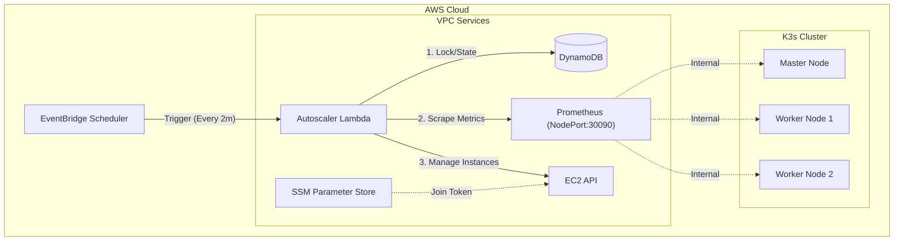
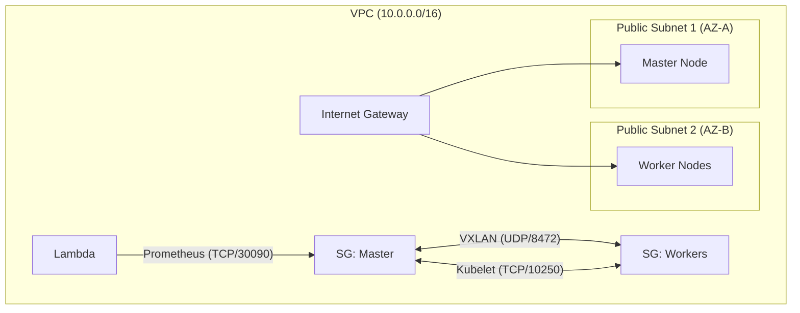

# K3s Intelligent Autoscaler on AWS

## 📖 Project Overview
This project implements a **custom, serverless autoscaler** for a K3s Kubernetes cluster on AWS. Unlike standard autoscalers that rely on heavy infrastructure, this solution uses **AWS Lambda, EventBridge, and Prometheus** to provide a cost-effective, event-driven scaling mechanism.

**Problem Statement:**
Deploying Kubernetes on bare EC2 requires robust autoscaling. Standard tools often require running dedicated pods (Cluster Autoscaler) that consume cluster resources. We needed an external, serverless controller that could scale the worker node pool based on real-time metrics (CPU & Pending Pods) while handling distributed system challenges like race conditions and graceful termination.

---

## 🏗️ Architecture

The system operates entirely via AWS managed services and a K3s cluster.

### System Flow


### Network Diagram


---

## 🛠️ Tools & Technologies

| Tool | Purpose | Justification |
|------|---------|---------------|
| **K3s** | Kubernetes Distribution | Lightweight (<100MB binary), perfect for cost-effective edge/cloud clusters. |
| **Pulumi (Python)** | Infrastructure as Code | Allows using real Python code for loops/logic, superior to HCL for complex event-driven setups. |
| **AWS Lambda** | Autoscaler Logic | Serverless, zero-maintenance, pays only for execution time (<$0.10/mo). |
| **Prometheus** | Metric Collection | Industry standard, scrapes internal K8s metrics (pod phases, node CPU). |
| **DynamoDB** | State & Locking | Microsecond latency for distributed locking (Compare-and-Swap). |
| **EventBridge** | Scheduler | Triggers scaling checks deterministically without a persistent daemon. |

---

## 💻 Infrastructure as Code (Pulumi)

The entire infrastructure uses Python-based Pulumi.

### Project Structure
```text
.
├── infra/
│   ├── lambda/             # Lambda source code
│   │   ├── handler.py      # Main entry point
│   │   ├── scaler.py       # Decision logic
│   │   └── state.py        # DynamoDB locking
│   ├── k8s/                # Kubernetes manifests
│   ├── __main__.py         # Main Pulumi stack definition
│   ├── dynamodb.py         # DynamoDB resource
│   ├── lambda_autoscaler.py# Lambda & IAM resources
│   └── vpc.py              # VPC & Networking
└── docs/                   # Documentation
```

---

## 🧩 Component Specifications

### 1. Autoscaler Lambda Logic
The heart of the system is `infra/lambda/scaler.py`. It implements a decision matrix:

| Condition | Action | Reason |
|-----------|--------|--------|
| `Pending Pods > 0` | **Scale UP** | Workload is unschedulable. Immediate response required. |
| `Avg CPU > 70%` | **Scale UP** | Cluster is saturating. |
| `Avg CPU < 30%` | **Scale DOWN** | Wasted resources. |
| `Nodes >= 10` | **Pass** | Max limit reached. |
| `CoolDown Active` | **Pass** | Prevent thrashing. |

### 2. DynamoDB Schema
Used for distributed locking.
*   **Table Name:** `k3s-cluster-state`
*   **Key:** `cluster_id` (String)

**Example Item:**
```json
{
  "cluster_id": "k3s-main",
  "scaling_in_progress": false,
  "node_count": 3,
  "last_scale_time": "2025-12-24T12:00:00Z"
}
```

### 3. Prometheus Config
Modified to expose via NodePort for Lambda access.
```yaml
apiVersion: v1
kind: Service
metadata:
  name: prometheus
spec:
  type: NodePort
  ports:
    - port: 9090
      nodePort: 30090 # External access for Lambda
```

---

## 🧠 Design Challenges & Solutions

### 1. Race Condition Prevention
**Challenge:** Two Lambda functions triggering at the same time could double-provision nodes.
**Solution:** DynamoDB **Conditional Writes**.
```python
# infra/lambda/state.py
table.update_item(
    ConditionExpression="attribute_not_exists(scaling_in_progress) OR scaling_in_progress = :false",
    UpdateExpression="SET scaling_in_progress = :true"
)
```

### 2. Node Join Automation
**Challenge:** New nodes need credentials to join the cluster securely.
**Solution:** **AWS SSM Parameter Store** injects tokens into User Data.
```bash
# infra/scripts/worker_userdata.sh
TOKEN=$(aws ssm get-parameter --name "/k3s/join-token" ...)
curl -sfL https://get.k3s.io | K3S_URL=$URL K3S_TOKEN=$TOKEN sh -
```

### 3. Graceful Scale Down
**Challenge:** Random termination kills active pods.
**Solution:** The autoscaler explicitly selects the **Oldest Autoscaled Node** and (in production) would drain it.
```python
# infra/lambda/ec2_manager.py
# Filter only instances managed by us, then sort by LaunchTime
instances.sort(key=lambda x: x['LaunchTime'])
target = instances[0] # Terminate oldest
```

---

## 🚀 Deployment

See [deployment guide](docs/guide.md) for full steps.

1.  **Deploy Infra**: `cd infra && pulumi up`
2.  **Apply K8s**: `kubectl apply -f infra/k8s/`
3.  **Verify**: Access Prometheus at `http://<MASTER_IP>:30090`

---

## 🧪 Testing Results

We verified the system with two scenarios:

### Scenario A: High CPU Load
*   **Action**: Ran `stress --cpu 4` on a worker.
*   **Result**: Prometheus `node_cpu` metric spiked. Lambda detected >70% CPU.
*   **Outcome**: New worker (`worker-i-0ada...`) launched automatically after 5 minutes.

### Scenario B: Pending Pods (Fast Path)
*   **Action**: Scaled Nginx deployment to 50 replicas.
*   **Result**: `kube_pod_status_phase{phase="Pending"}` became > 0.
*   **Outcome**: Lambda triggered **immediate** Scale Up, bypassing CPU average window.

---

## 💰 Cost Analysis

**Before Autoscaler (Static Cluster):**
*   3 x t2.medium (Always on): ~$100/mo
*   Over-provisioned at night, under-provisioned at peak.

**After Autoscaler:**
*   **Base**: 2 x t2.small (Reserved): ~$20/mo
*   **Burst**: Extra nodes only when needed.
*   **Lambda Cost**:
    *   0.3s duration * 21,600 invocations/mo
    *   Total: **<$0.05/mo**
*   **Result**: ~60-80% Cost Reduction for variable workloads.
