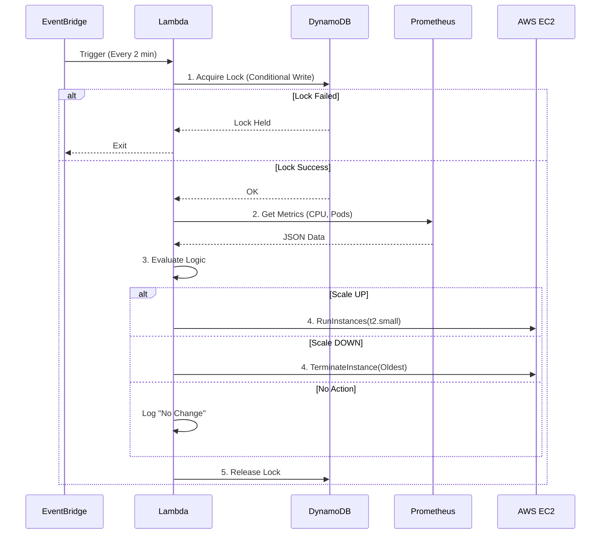

# System Operation Sequence

This document details the exact step-by-step sequence of operations that occurs during a single execution cycle of the K3s Autoscaler.

---

## 🔄 High-Level Flow

---

## 📝 Detailed Step-by-Step Breakdown

### Phase 1: Initiation
**1. Trigger**
*   **Source:** AWS EventBridge Rule (`k3s-autoscaler-schedule`)
*   **Action:** Fires a JSON event every **2 minutes**.
*   **Target:** `k3s-autoscaler` Lambda function.

### Phase 2: State Management (Locking)
**2. Lock Acquisition**
*   **Goal:** Prevent race conditions if a previous Lambda is still running or stuck.
*   **Action:** Lambda calls DynamoDB `UpdateItem` on table `k3s-cluster-state`.
*   **Condition:** `set scaling_in_progress = True` ONLY IF `scaling_in_progress` does not exist OR is `False`.
*   **Outcome:**
    *   If successful: Proceed.
    *   If failed (ConditionalCheckFailedException): Another execution is running. **Exit immediately.**

**3. Cooldown Check**
*   **Goal:** Prevent thrashing (rapid up/down scaling).
*   **Action:** Check `last_scale_time` in DynamoDB.
*   **Logic:** If `(Current Time - last_scale_time) < 5 minutes`, log "Cooldown active" and **Release Lock & Exit**.

### Phase 3: Metric Collection
**4. Connect to Prometheus**
*   **Endpoint:** `http://<MASTER_IP>:30090/api/v1/query`
*   **Query 1 (CPU):** `sum(rate(container_cpu_usage_seconds_total{id="/"}[5m])) / sum(machine_cpu_cores) * 100`
    *   Calculates total cluster CPU usage percentage via cAdvisor.
*   **Query 2 (Pending Pods):** `kube_pod_status_phase{phase="Pending"}`
    *   Checks for unschedulable workloads.
*   **Query 3 (Node Count):** `count(kube_node_status_condition{condition="Ready",status="true"})`
    *   Current cluster size.

### Phase 4: Decision Logic
**5. Evaluation**
The Lambda compares metrics against thresholds defined in environment variables.

| Priority | Check | Threshold | Decision |
|----------|-------|-----------|----------|
| 1 | Pending Pods | `> 0` | **Scale UP** (Fast Path) |
| 2 | Avg CPU | `> 70%` | **Scale UP** |
| 3 | Avg CPU | `< 30%` | **Scale DOWN** |
| 4 | Else | - | **Do Nothing** |

**Constraints:**
*   If `Action == Scale UP` AND `Node Count >= 10`: **Abort** (Max limit).
*   If `Action == Scale DOWN` AND `Node Count <= 2`: **Abort** (Min limit).

### Phase 5: Execution
**6a. Scale UP Action**
*   **Call:** `ec2.run_instances()`
*   **Config:**
    *   Image ID: Ubuntu AMI (same as other workers)
    *   Instance Type: `t2.small`
    *   Subnet: Round-robin selection of public subnets.
    *   Security Group: `k3s-worker-sg`
    *   IAM Role: `k3s-worker-role`
    *   User Data: Script to fetch Token from SSM and run `curl ... | sh -`.
    *   Tags: `ManagedBy: autoscaler`, `Name: k3s-worker-auto-<uuid>`

**6b. Scale DOWN Action**
*   **Call:** `ec2.describe_instances(Filters=[tag:ManagedBy=autoscaler])`
*   **Logic:** Sort list by `LaunchTime` (Ascending). Select the **first** (oldest) instance.
*   **Call:** `ec2.terminate_instances(InstanceIds=[oldest_id])`

### Phase 6: Finalization
**7. Update State**
*   **Action:** Update DynamoDB.
*   **Data:** Set `node_count` to new value. Set `last_scale_time` to Now.

**8. Release Lock**
*   **Action:** Update DynamoDB `scaling_in_progress = False`.
*   **Result:** System is ready for the next scheduled trigger.

---

## 🛠️ Node Bootstrap Sequence (Scale UP Only)
Once the Lambda launches the EC2 instance, the node itself performs these steps:

1.  **Boot:** OS starts up.
2.  **User Data Script:**
    *   Install AWS CLI.
    *   Available SSM Parameters:
        *   `/k3s/join-token`: The secure cluster secret.
        *   `/k3s/master-ip`: The fixed IP of the control plane.
    *   Run K3s Installer: `curl ... | K3S_URL=... K3S_TOKEN=... sh -`
3.  **Join:** The K3s agent on the node talks to the Master.
4.  **Ready:** Master marks node as `Ready`.
5.  **Schedulable:** Pending pods are now scheduled onto this new node.
