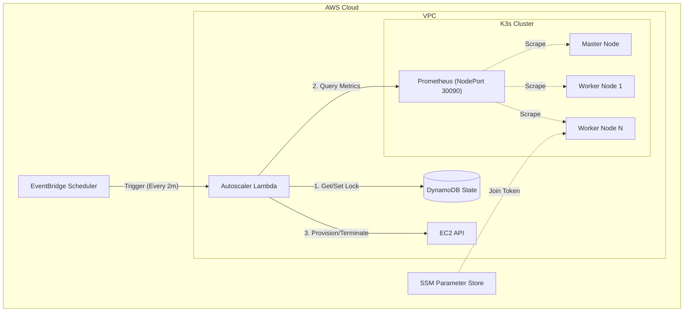
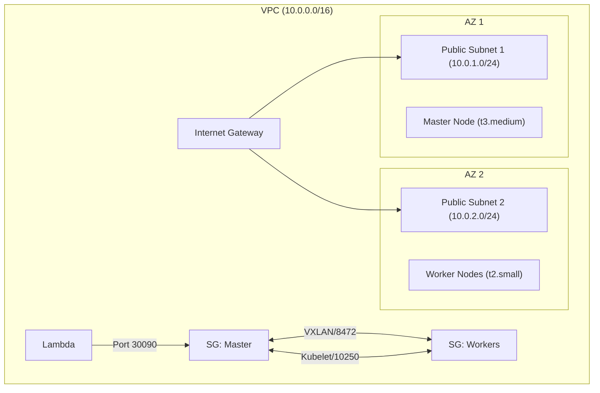

# K3s Autoscaler on AWS - Final Deliverable

This document provides a comprehensive technical overview of the K3s Autoscaler system implemented on AWS using Pulumi.

---

## 1. Architecture Diagram

### System Architecture
The system follows a serverless, event-driven architecture to automatically scale K3s worker nodes based on cluster metrics.



### Network Architecture
The infrastructure is deployed in a VPC with public subnets across availability zones.



---

## 2. Component Specifications

### A. Lambda Function (`k3s-autoscaler`)

**Logic Pseudocode:**
```python
def handler(event, context):
    1. Acquire distributed lock in DynamoDB (prevent race conditions)
    2. Fetch metrics from Prometheus (CPU, Pending Pods, Node Count)
    3. Evaluate scaling rules:
       IF pending_pods > 0 AND nodes < MAX:
           Scale UP (+1 node)
       ELSE IF cpu > 70% AND nodes < MAX:
           Scale UP (+1 node)
       ELSE IF cpu < 30% AND pending_pods == 0 AND nodes > MIN:
           Scale DOWN (-1 node)
    4. Execute EC2 Action (RunInstances or TerminateInstances)
    5. Release lock
```

**Environment Variables:**
| Variable | Value (Example) | Description |
|----------|-----------------|-------------|
| `PROMETHEUS_URL` | `http://13.212.x.x:30090` | Endpoint for metrics |
| `DYNAMODB_TABLE` | `k3s-cluster-state` | State table name |
| `MIN_NODES` | `2` | Minimum cluster size |
| `MAX_NODES` | `10` | Maximum cluster size |
| `SCALE_UP_CPU_THRESHOLD` | `70` | % CPU to trigger scale out |
| `SCALE_DOWN_CPU_THRESHOLD` | `30` | % CPU to trigger scale in |

**IAM Policy (JSON):**
```json
{
    "Version": "2012-10-17",
    "Statement": [
        {
            "Effect": "Allow",
            "Action": [
                "ec2:RunInstances",
                "ec2:TerminateInstances",
                "ec2:DescribeInstances",
                "ec2:CreateTags"
            ],
            "Resource": "*"
        },
        {
            "Effect": "Allow",
            "Action": [
                "dynamodb:GetItem",
                "dynamodb:PutItem",
                "dynamodb:UpdateItem"
            ],
            "Resource": "arn:aws:dynamodb:*:*:table/k3s-cluster-state"
        },
        {
            "Effect": "Allow",
            "Action": ["ssm:GetParameter"],
            "Resource": "arn:aws:ssm:*:*:parameter/k3s/*"
        }
    ]
}
```

### B. Prometheus Configuration

**Scrape Config (`prometheus.yml`):**
```yaml
scrape_configs:
  - job_name: 'kubernetes-nodes'
    kubernetes_sd_configs:
      - role: node
    relabel_configs:
      - action: labelmap
        regex: __meta_kubernetes_node_label_(.+)
```

**Key Metrics (PromQL):**
| Metric Name | PromQL Query | Purpose |
|-------------|--------------|---------|
| **Avg CPU Usage** | `sum(rate(container_cpu_usage_seconds_total{id="/"}[5m])) / sum(machine_cpu_cores) * 100` | Primary scaling metric (cAdvisor) |
| **Pending Pods** | `kube_pod_status_phase{phase="Pending"}` | Fast-path scale up trigger |
| **Ready Nodes** | `count(kube_node_status_condition{condition="Ready",status="true"})` | Constraint checking |

### C. DynamoDB Schema

**Table:** `k3s-cluster-state`
*   **Partition Key:** `cluster_id` (String)

**Attributes:**
| Attribute | Type | Description |
|-----------|------|-------------|
| `cluster_id` | String | Unique ID (e.g., "k3s-main") |
| `node_count` | Number | Current tracking of nodes |
| `scaling_in_progress` | Boolean | Lock flag to prevent races |
| `last_scale_time` | String (ISO) | Timestamp for cooldown logic |
| `cooldown_until` | String (ISO) | When next scaling is allowed |

**Example Item:**
```json
{
  "cluster_id": "k3s-main",
  "node_count": 3,
  "scaling_in_progress": false,
  "last_scale_time": "2025-12-24T12:00:00Z"
}
```

### D. EC2 User Data Script (Worker)

This script runs on instance boot to auto-join the cluster.

```bash
#!/bin/bash
# Install AWS CLI
apt-get update && apt-get install -y awscli curl

# Retrieve Cluster Secrets from SSM
TOKEN=$(aws ssm get-parameter --name "/k3s/join-token" --with-decryption --query "Parameter.Value" --output text)
MASTER_IP=$(aws ssm get-parameter --name "/k3s/master-ip" --query "Parameter.Value" --output text)
URL="https://${MASTER_IP}:6443"

# Install K3s Agent
curl -sfL https://get.k3s.io | K3S_URL=${URL} K3S_TOKEN=${TOKEN} sh -
```

---

## 3. Scaling Algorithm

### Logic Flow
1.  **Check Locks**: If `scaling_in_progress` is TRUE or `cooldown_until` > Now, **EXIT**.
2.  **Evaluate Scale UP**:
    *   Condition: `Pending Pods > 0` OR `CPU > 70%`
    *   Constraint: `Current Nodes < MAX_NODES`
    *   Action: Launch 1 new t2.small instance.
3.  **Evaluate Scale DOWN**:
    *   Condition: `CPU < 30%` AND `Pending Pods == 0`
    *   Constraint: `Current Nodes > MIN_NODES`
    *   Wait: Metric average window (5 mins) ensures short dips don't trigger this.
    *   Action: Terminate oldest autoscaled instance.

### Cooldown Rationale
*   **Duration**: 5 minutes.
*   **Reason**: Booting a node and joining K3s takes ~2-3 minutes. Without a cooldown, the scaler might launch a second node before the first one reports ready, leading to over-provisioning.

### Edge Case Handling
*   **Lambda Timeout**: DynamoDB lock prevents concurrent runs. Lock expiry (future enhancement) handles crashed Lambdas.
*   **Master Changes**: Workers use SSM Parameter for Master IP, allowing master replacement without changing worker config.
*   **Network Partition**: NodePort exposure allows Prometheus access even if pod IP networking is internal-only.

---

## 4. Monitoring & Alerting

### Key CloudWatch Metrics
*   **Lambda**: `Errors`, `Duration`, `Invocations`.
*   **EC2**: `CPUUtilization` (Raw AWS metric as backup).
*   **DynamoDB**: `ConditionalCheckFailedRequests` (Indicates race condition prevention working).

### Dashboard Layout
A CloudWatch Dashboard should include:
1.  **Scaling Activity**: Lambda Invocations per hour.
2.  **Health**: Lambda Error Rate.
3.  **Resource Usage**: Average Cluster CPU (pushed as custom metric).
4.  **Capacity**: Active Node Count trend.

### Alarms
*   **Scaling Failure**: Lambda Errors > 0 for 3 consecutive data points.
*   **Capacity Warning**: Node Count >= MAX_NODES (Warning severity).

---

## 5. Testing Strategy

### A. Simulating Scale-Up
**Method**: CPU Stress Test
```bash
# SSH to a worker
ssh ubuntu@<worker-ip>

# Generate 4-core load for 5 minutes
stress --cpu 4 --timeout 300
```
**Expected Result**: New node appears in `kubectl get nodes` within 5-7 minutes.

**Method**: Pending Pods (Fast Path)
```bash
# Create 50 replicas of Nginx (requesting resources)
kubectl create deployment load-test --image=nginx --replicas=50
```
**Expected Result**: Immediate scale-up trigger due to `Pending` pods.

### B. Testing Scale-Down
**Method**: Remove Load
1.  Stop the `stress` command or delete the `load-test` deployment.
2.  Wait for Cooldown (5 mins) + Metric Stabilization (5 mins).
**Expected Result**: The oldest autoscaled node enters `Terminated` state in AWS Console and disappears from `kubectl get nodes`.

### C. Failure Scenarios
1.  **Lambda Timeout**: Manually set Lambda timeout to 1s.
    *   *Result*: Execution fails, DynamoDB lock might remain (requires TTL/expiry logic to fix).
2.  **EC2 Quota Exceeded**:
    *   *Result*: `RunInstances` API call fails. Lambda logs error to CloudWatch. System retries next cycle.
3.  **Prometheus Down**:
    *   *Result*: Lambda catches connection error, logs "Failed to fetch metrics", and aborts scaling decision (fail-safe).
