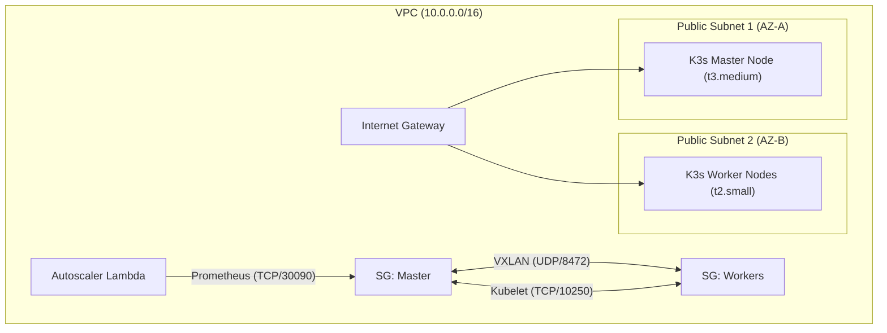
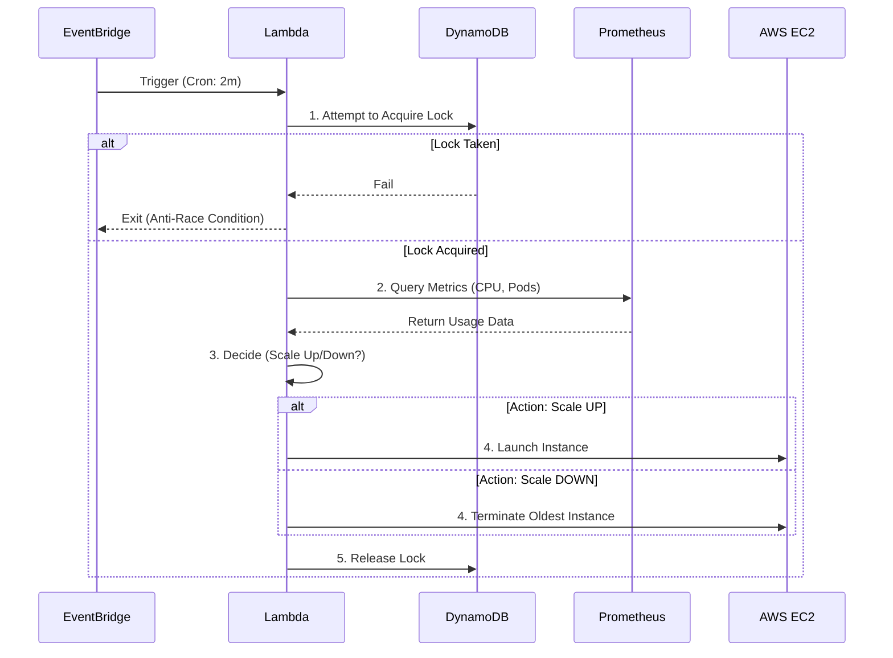

# Building a Serverless Autoscaler for K3s on AWS

In this article, we will explore how to build a **custom, event-driven autoscaler** for a K3s Kubernetes cluster using AWS Lambda, DynamoDB, and Prometheus. This approach enables intelligent scaling based on real-time cluster metrics without the overhead of heavy management nodes.

---

## 1. Minimalist Kubernetes: The Problem Statement

Running Kubernetes on the cloud often involves managed services like EKS, which are powerful but can be expensive and complex for smaller workloads. **K3s** is a lightweight distribution perfect for edge and cost-sensitive scenarios.

However, K3s on bare EC2 instances lacks a native cloud autoscaler. If your traffic spikes, your pods stay pending. If traffic drops, you pay for idle servers.

**Our Solution:** A "Serverless" Controller that watches Prometheus metrics and provisions EC2 instances on-demand.

---

## 2. Infrastructure & Network Architecture

We deployed the infrastructure using **Pulumi (Infrastructure as Code)**.

### Network Topology
The cluster lives in a VPC with public subnets across two Availability Zones for high availability.



### Key Components
1.  **Master Node**: Runs the K3s control plane and Prometheus.
2.  **Worker Nodes**: Where the actual app pods run.
3.  **Prometheus**: Scrapes metrics from all nodes via NodePort.
4.  **Lambda**: The Brain. It runs outside the cluster to ensure stability.
5.  **DynamoDB**: The Memory. Stores cluster state and handles distributed locking.

---

## 3. Operational Logic: How it Works

The system does not run continuously. Instead, it wakes up every **2 minutes** (triggered by EventBridge), checks health, and goes back to sleep. This "Scale-to-Zero" architecture costs less than $0.10/month.

### Sequence Diagram



---

## 4. Project Structure

The codebase is organized as follows:

```text
├── infra/
│   ├── k8s/                 # Kubernetes manifests (Prometheus)
│   │   ├── prometheus-*.yaml
│   │   └── kube-state-metrics.yaml
│   ├── lambda/              # Autoscaler Logic Source Code
│   │   ├── handler.py       # Main Entry point
│   │   ├── metrics.py       # Prometheus Interface
│   │   ├── scaler.py        # Decision Algorithm
│   │   ├── state.py         # DynamoDB Interface
│   │   └── ec2_manager.py   # AWS EC2 Interface
│   ├── scripts/             # User Data (Bootstrap) Scripts
│   │   ├── master_userdata.sh
│   │   └── worker_userdata.sh
│   ├── __main__.py          # Pulumi Entry Point (Orchestrator)
│   ├── config.py            # Configuration loading
│   ├── dynamodb.py          # State Table definition
│   ├── lambda_autoscaler.py # Lambda Function & IAM Config
│   ├── master.py            # Master Node Definition
│   ├── workers.py           # Worker Node Definition
│   ├── vpc.py               # Networking definitions
│   └── security_groups.py   # Security Group definitions
├── docs/
│   └── guide.md             # Usage Guide
└── README.md                # Project Overview
```

---

## 5. Code Deep Dive

Let's look at the core logic blocks.

### A. The Decision Engine (`scaler.py`)
This pure function takes metrics and returns an action. It doesn't know about AWS or K8s, it just knows numbers.

```python
# infra/lambda/scaler.py
def decide(self, avg_cpu, pending_pods, current_nodes, ...):
    
    # Rule 1: Fast Path (Pending Pods)
    # If pods are waiting, we MUST scale up immediately
    if pending_pods > 0 and current_nodes < MAX_NODES:
        return {"action": "scale_up", "reason": "Pending pods detected"}

    # Rule 2: Load Based (CPU > 70%)
    if avg_cpu > 70 and current_nodes < MAX_NODES:
        return {"action": "scale_up", "reason": "High CPU load"}

    # Rule 3: Efficiency (CPU < 30%)
    if avg_cpu < 30 and pending_pods == 0 and current_nodes > MIN_NODES:
        return {"action": "scale_down", "reason": "Underutilized"}
```

### B. Metric Collection (`metrics.py`)
We need to calculate the *Cluster-wide CPU usage*. Since K3s runs processes in containers, we use cAdvisor metrics.

**PromQL Query:**
```promql
sum(rate(container_cpu_usage_seconds_total{id="/"}[5m])) / sum(machine_cpu_cores) * 100
```
This formula sums up the CPU time used by all containers on all nodes and divides it by the total available CPU cores.

```python
# infra/lambda/metrics.py
def get_average_cpu(self) -> float:
    query = 'sum(rate(container_cpu_usage_seconds_total{id="/"}[5m])) / sum(machine_cpu_cores) * 100'
    result = self._query(query)
    # Returns a float (0.0 to 100.0)
    return round(float(result...), 2)
```

### C. Locking & State (`state.py`)
Preventing Race Conditions is critical. If two Lambdas run at once, we might double-scale. We use **DynamoDB Conditional Writes**.

```python
# infra/lambda/state.py
def acquire_lock(self):
    self.table.update_item(
        Key={"cluster_id": self.cluster_id},
        UpdateExpression="SET scaling_in_progress = :true",
        # This condition guarantees atomicity
        ConditionExpression="attribute_not_exists(scaling_in_progress) OR scaling_in_progress = :false",
        ExpressionAttributeValues={":true": True, ":false": False}
    )
```

### D. Automated Node Joining (`ec2_manager.py`)
When a new node launches, it must join the cluster automatically. We use **User Data** scripts injected with secrets from **SSM Parameter Store**.

```python
# infra/lambda/ec2_manager.py
user_data = """#!/bin/bash
# 1. Get Token securely
TOKEN=$(aws ssm get-parameter --name "/k3s/join-token" --with-decryption ...)
MASTER_IP=$(aws ssm get-parameter --name "/k3s/master-ip" ...)

# 2. Join Cluster
curl -sfL https://get.k3s.io | K3S_URL=https://$MASTER_IP:6443 K3S_TOKEN=$TOKEN sh -
"""
```

---

## 6. Testing Strategy & Results

We validated the system using three methods:

### 1. Scale Up Test (CPU Load)
**Scenario:** Simulate heavy computation.
*   **Command:** `stress --cpu 4` (on a 2-core node)
*   **Observation:** Prometheus CPU metric spiked to 100%.
*   **Result:** Lambda detected load > 70%. A new EC2 instance (`t2.small`) was provisioned.

### 2. Scale Up Test (Pending Pods)
**Scenario:** Deploy more pods than the cluster can hold.
*   **Command:** `kubectl create deployment nginx --replicas=50`
*   **Observation:** `kube_pod_status_phase="Pending"` count went up using `kubectl get pods`.
*   **Result:** Lambda triggered "scale_up" immediately, bypassing the CPU average window.

### 3. Scale Down Test
**Scenario:** Remove load and wait.
*   **Command:** `kubectl delete deployment nginx`
*   **Observation:** CPU dropped < 5%.
*   **Result:** After the **5-minute Cooldown** (to prevent thrashing), the autoscaler identified the oldest autoscaled node and terminated it.

---

## 7. Distributed System Challenges

During development, we solved several key distributed system problems:

1.  **Race Conditions:** Solved using DynamoDB optimistic locking.
2.  **State Management:** By externalizing state to DynamoDB, the Lambda remains effectively stateless and robust.
3.  **Connectivity:** Accessed internal K8s metrics via a public NodePort (`30090`) secured by Security Groups (Lambda-only access).
4.  **Graceful Termination:** The logic explicitly filters for instances tagged `ManagedBy: autoscaler` and sorts by `LaunchTime` (Removing the oldest first) to avoid killing the critical Master node.

---

## Conclusion

This project demonstrates that you don't need complex managed services to achieve high availability and elasticity. By combining simple building blocks—EventBridge, Lambda, and Prometheus—we built a robust, self-healing, and cost-efficient Kubernetes cluster on AWS.
